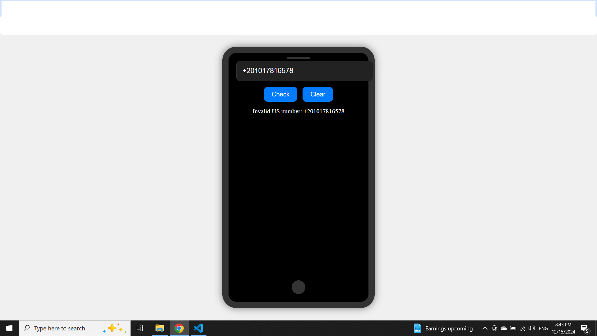

# Telephone-Number-Validator




# Telephone Number Validator

This project is a simple web application that validates US phone numbers. It provides a user-friendly interface that looks like a phone screen, where users can input a phone number and check its validity.

## Features

- Input field styled to look like a phone screen.
- Buttons to check the validity of the phone number and clear the input.
- Displays whether the phone number is valid or invalid.
- Supports various valid US phone number formats.


## Valid US Phone Number Formats

- `1 555-555-5555`
- `1 (555) 555-5555`
- `5555555555`
- `555-555-5555`
- `(555)555-5555`
- `1(555)555-5555`
- `1 555 555 5555`

## Invalid US Phone Number Formats

- `555-5555`
- `5555555`
- `1 555)555-5555`
- `123**&!!asdf#`
- `55555555`
- `(6054756961)`
- `2 (757) 622-7382`
- `0 (757) 622-7382`
- `-1 (757) 622-7382`
- `2 757 622-7382`
- `10 (757) 622-7382`
- `27576227382`
- `(275)76227382`
- `2(757)6227382`
- `2(757)622-7382`
- `555)-555-5555`
- `(555-555-5555`
- `(555)5(55?)-5555`
- `55 55-55-555-5`
- `11 555-555-5555`

## Installation

1. Clone the repository:
    ```sh
    git clone https://github.com/your-username/Telephone-Number-Validator.git
    ```
2. Navigate to the project directory:
    ```sh
    cd Telephone-Number-Validator
    ```

## Usage

1. Open [index.html](http://_vscodecontentref_/1) in your web browser.
2. Enter a phone number in the input field.
3. Click the "Check" button to validate the phone number.
4. Click the "Clear" button to clear the input and results.

## Files

- [index.html](http://_vscodecontentref_/2): The main HTML file containing the structure of the web application.
- `styles.css`: The CSS file for styling the web application.
- [script.js](http://_vscodecontentref_/3): The JavaScript file containing the logic for validating phone numbers.

## License

This project is licensed under the MIT License. See the [LICENSE](http://_vscodecontentref_/4) file for details.

## Contributing

Contributions are welcome! Please open an issue or submit a pull request for any improvements or bug fixes.

## Acknowledgements

- Inspired by various phone number validation projects and tutorials.
